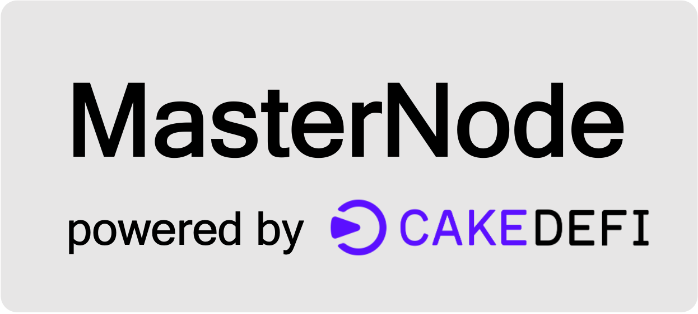

<div id="top"></div>


<!-- PROJECT LOGO -->
<br />
<div align="center">
  
  <h3 align="center">MasterNode</h3>
  <p align="center">
    Cake DeFi JavaScript React Exercise - Masternode assets under management
  </p>
</div>


<!-- TABLE OF CONTENTS -->
<details>
  <summary>Table of Contents</summary>
  <ol>
    <li>
      <a href="#about-the-project">About The Project</a>
    </li>
    <li>
      <a href="#built-with">Built With</a>
    </li>
    <li>
      <a href="#getting-started"">Getting Started</a>
    </li>
    <li>
      <a href="#features">Features</a>
    </li>
    <li>
      <a href="#design-considerations">Design Considerations</a>
    </li>
  </ol>
</details>


<!-- ABOUT THE PROJECT -->
## About The Project
MasterNode is a platform for users to 
* easily view the total assets managed by Cake DeFi by node
* track the latest staking rewards by node
* track the value of each coin

View the live demo site [here](https://masternode-assets.vercel.app/)

<p align="right">(<a href="#top">back to top</a>)</p>


## Built With

### Frontend
* [Next.js](https://nextjs.org/)
* [Tailwind](https://tailwindcss.com/)
* [Chart.js](https://www.chartjs.org/)

### External APIs used
* [Cake DeFi Nodes API](https://api.cakedefi.com/nodes?order=status&orderBy=DESC)
* [CoinGecko API](https://www.coingecko.com/en/api)

<p align="right">(<a href="#top">back to top</a>)</p>


## Getting Started

### Prerequisites
* node v19.7.0

### Install Node dependencies
Run `npm install` to install dependencies

### Running the development server

```bash
npm run dev
```

Open [http://localhost:3000](http://localhost:3000) with your browser to see the result.

<p align="right">(<a href="#top">back to top</a>)</p>


## Features

### Total Assets Under Management

Users are able to view at a single glance
* total assets' value in a selected currency such as `USD`, `SGD`, `EUR`, `BTC`
* individual asset's value in a selected currency
  * 1 Dash Node holds 1,000 DASH
  * 1 DeFiChain Node holds 20,000 DFI
  * `1 Ether Node holds 100 ETH (arbitrary)`
* proportion of individual asset to total assets in a selected currency on a pie chart


> Total Assets' value in selcted currency

### Staking Rewards
* View latest staking rewards for a node, and its coin value attributes
* Track price percentage change of coin at certain time intervals on a line chart


> Node Card


> Dismissable Node Modal on clicking Node Card

### Mobile Responsiveness


> Shown on iPhone 14 in Safari browser

<p align="right">(<a href="#top">back to top</a>)</p>


## Design Considerations

### Server Side Rendering
Due to the large API response sizes, approximately 2.73 MB, that is used to populate the page, Next.js `getServerSideProps` is preferred as it allows data to be fetched on the server-side and renders the page with the data before sending it to the client
* This helps to manage memory on the client side more efficiently as it does not need to load the entire response into memory on the client side
* This also leads to faster page load times as it reduces the amount of data that needs to be downloaded by the client

### Caching
Implemented LRU Cache to cache API responses and Next.js `getServerSideProps` responses
* By keeping frequently accessed data in memory, time needed to access data would be lower
* LRU Cache can be customised to only store a limited amount of data in memory by keeping only the most recently used data - currently set as `max: 100`


<p align="right">(<a href="#top">back to top</a>)</p>


## Acknowledgement
I would like to thank Cake DeFi for giving me the resources and opportunity to work on such an interesting assignment. Special thanks to the various libraries and API provides for making this possible as well! 
